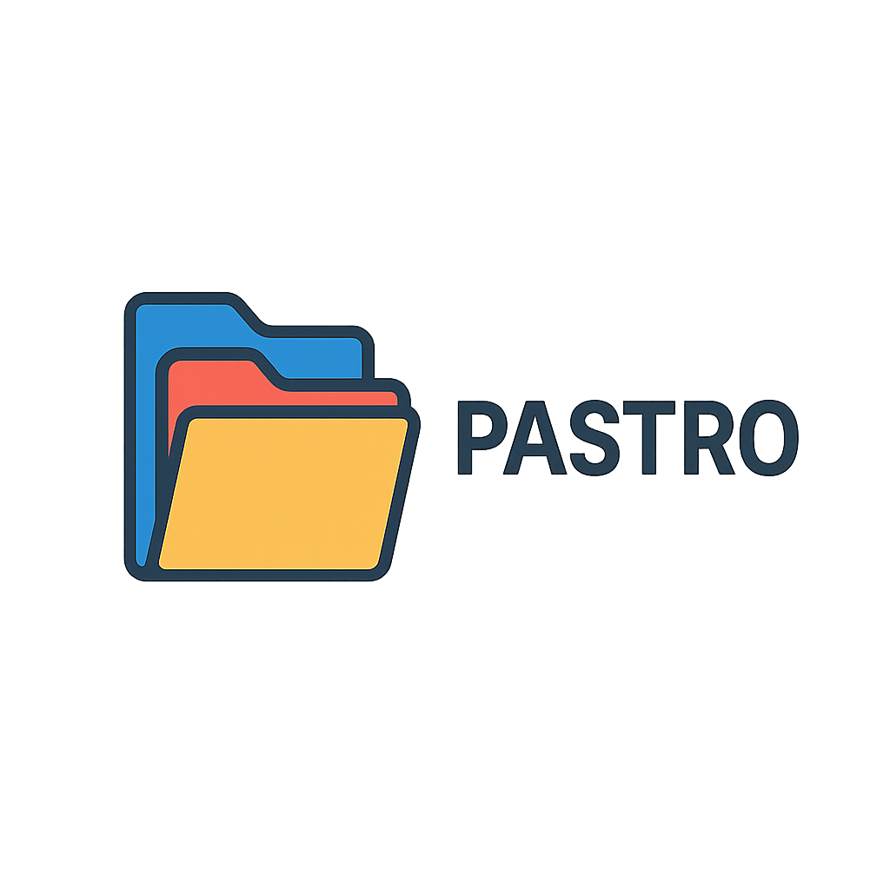

# Sistema Organizador de Pastas (Pastro)



Um aplicativo desktop desenvolvido em Python para organização automática de pastas e arquivos, com interface gráfica intuitiva e categorização inteligente.

## 🚀 Funcionalidades

- **Interface Gráfica (PyQt6)**
  - Seleção de pastas
  - Visualização em árvore
  - Preview de alterações
  - Barra de progresso
  - Splash screen

- **Classificação Automática**
  - Identificação de tipos de arquivos
  - Categorização por extensão
  - Suporte para múltiplos formatos

- **Distribuição**
  - Executável standalone
  - Ícone personalizado
  - Recursos embutidos

## 📋 Pré-requisitos

- Python 3.13 ou superior
- Git (para clonar o repositório)

## 🔧 Instalação

1. Clone o repositório:
```bash
git clone [URL_DO_REPOSITÓRIO]
cd pastro
```

2. Instale as dependências:
```bash
pip install -r requirements.txt
```

## 🛠️ Desenvolvimento

O projeto segue as seguintes regras de desenvolvimento:

- **Código**
  - Código em inglês
  - Documentação em português
  - Segue PEP 8
  - Usa type hints

- **Interface**
  - Design responsivo
  - Feedback visual claro
  - Mensagens em português
  - Ícones intuitivos

## 🎮 Como Usar

1. Execute o programa:
```bash
python src/main.py
```

2. Na interface:
   - Selecione a pasta que deseja organizar
   - Visualize a estrutura atual
   - Clique em "Organizar" para ver o preview
   - Confirme para aplicar as alterações

## 📦 Distribuição

O projeto usa PyInstaller para gerar um executável standalone:

```bash
cd src
pyinstaller pastro.spec
```

O executável será gerado em `src/dist/Pastro.exe`

### Recursos
- Arquivos de recursos em `src/resources`
- PNG para imagens com transparência
- ICO para ícones do Windows
- Todos os recursos incluídos no executável

## 🔄 Próximos Passos

1. **Melhorias de Performance**
   - Otimização do classificador
   - Cache de resultados
   - Processamento assíncrono

2. **Novas Funcionalidades**
   - Regras personalizadas
   - Filtros avançados
   - Plugins/extensões

3. **Documentação**
   - Manual do usuário
   - Guia de desenvolvimento
   - Exemplos de uso

## 🤝 Contribuições

Contribuições são bem-vindas! Para contribuir:

1. Faça um fork do projeto
2. Instale as dependências: `pip install -r requirements.txt`
3. Faça suas alterações seguindo as regras de desenvolvimento
4. Execute os testes e verificações:
   ```bash
   black src/
   flake8 src/
   pytest
   ```
5. Envie um Pull Request

## 📄 Licença

Este projeto está sob a licença MIT. Veja o arquivo [LICENSE](LICENSE) para mais detalhes. 